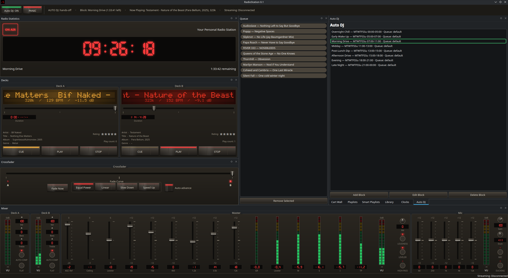

# RadioStation

**Radio automation and playout for Linux.** A desktop console for running a
music station unattended: automatic scheduling, beat-aware crossfading,
a cart wall for jingles and sweepers, broadcast clock wheels, a mastering
chain, and direct Icecast streaming.

> Version 0.1 — first public release. See [CHANGELOG.md](CHANGELOG.md).



## Features

- **Auto DJ** — weighted rotation across user-defined categories, with
  artist/title separation rules, so the station keeps itself on air.
- **Schedule blocks** — day/time windows that switch playlist, selection
  strategy and cart behaviour automatically.
- **Clock wheels** — reusable hour templates (music sweeps, news, carts at
  fixed minute offsets) that resume mid-hour after a restart.
- **Cart Wall** — a hotkey grid of jingles/beds/sweepers. Schedule
  automation can fire carts *between* songs (a genuine hard cut) or
  *overlaid* on the outgoing song; individual clips can be flagged
  **in-between only** so a jingle carrying its own music bed is never
  overlaid.
- **Dual-deck mixing** — equal-power automatic crossfades, cue-ahead of the
  idle deck, manual override at any point.
- **Mastering chain (MixEngine)** — K-weighted loudness leveler,
  true-peak lookahead limiter, per-channel and master EQ, mic ducking.
- **Streaming** — direct Icecast/Shoutcast output (MP3 / Ogg Vorbis / Opus)
  via GStreamer `shout2send`.
- **Library** — SQLite-backed browser with full-text search, smart
  playlists, star ratings, ReplayGain analysis and loudness history.
- **Console UI** — hand-painted faders, rotary knobs, LED meters and
  dot-matrix deck displays; every panel is a dockable/floatable widget.

A batch **library cleanup** toolkit (tagging, dedup, normalisation) lives in
[`tools/library_cleanup/`](tools/library_cleanup/) as a separate Python CLI/TUI.

## Building

### Prerequisites

- CMake ≥ 3.21, a C++17 compiler
- **Qt 6** — Core, Widgets, Gui, Sql, Svg, Test
- **GStreamer 1.0** — core plus `gstreamer-app`, `gstreamer-audio`,
  `gstreamer-tag`, `gstreamer-pbutils`, `gstreamer-controller`, and the
  `base` / `good` / `libav` plugin sets (plus an MP3 encoder — `lamemp3enc`)
  for decoding and streaming
- **TagLib** (`taglib`) — for writing ReplayGain tags
- `pkg-config`

On Fedora:

```sh
sudo dnf install cmake gcc-c++ \
    qt6-qtbase-devel qt6-qtsvg-devel \
    gstreamer1-devel gstreamer1-plugins-base-devel \
    gstreamer1-plugins-good gstreamer1-plugins-bad-free gstreamer1-libav \
    taglib-devel pkgconf-pkg-config
```

On Debian/Ubuntu:

```sh
sudo apt install cmake g++ \
    qt6-base-dev qt6-svg-dev \
    libgstreamer1.0-dev libgstreamer-plugins-base1.0-dev \
    gstreamer1.0-plugins-good gstreamer1.0-plugins-bad gstreamer1.0-libav \
    libtag1-dev pkg-config
```

### Build & run

```sh
cmake -S . -B build
cmake --build build -j
./build/src/app/rs_app
```

For an optimised build use `-DCMAKE_BUILD_TYPE=Release`.

### Tests

```sh
QT_QPA_PLATFORM=offscreen ctest --test-dir build --output-on-failure
```

### Install (optional)

```sh
sudo cmake --install build --prefix /usr/local
```

Installs `rs_app`, a `.desktop` entry and the app icon into the standard
XDG locations.

## Project layout

| Path | Contents |
|------|----------|
| `src/core` | logging |
| `src/db` | SQLite schema, migrations, repositories |
| `src/scheduler` | Auto DJ, clock wheels, block/time resolution |
| `src/audio` | GStreamer pipelines, decks, crossfade, MixEngine, cart engines, streaming |
| `src/ui` | Qt widgets, console theme, dialogs, `MainWindow` |
| `src/app` | `main.cpp` entry point |
| `tests/` | QtTest suites, mirroring `src/` |
| `tools/library_cleanup` | standalone Python library-maintenance toolkit |

## License

RadioStation is licensed under the **GNU General Public License v3.0**.
See [LICENSE](LICENSE).
